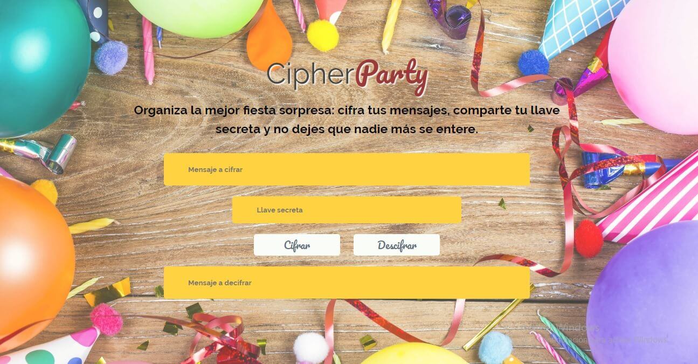

# Chiper Party

## Descripción

Chiper Party es una aplicación que permite cifrar/decifrar mensajes por medio de una llave númerica a personas interesadas en organizar fiestas sorpresas, manteniendo oculta toda la información importante.

## Funcionalidad

Esta aplicación utiliza la fórmula del cifrado César para ocultar los mensajes introducidos.

Para su funcionamiento la aplicación requiere de los siguientes datos:

1. Cadena de Texto / Mensaje 
2. Llave numérica 

Ingresando ambos datos en los campos especificados, la aplicación tiene dos funciones representadas por dos botones: `Cifrar` y `Descifrar`.

La aplicación permite ingresar mensajes utilizando **mayúsculas, minúsculas y espacios**. 

## Usuarios

La aplicación esta desarrollada para usuarios que tengan planeada la organización de una fiesta o evento sorpresa y deseen mantener la información relacionada en _secreto_ o de forma _oculta_.

Al ingresar el mensaje y la llave numérica, el usuario obtendrá el mensaje cifrad. De igual forma, cualquier usuario que reciba el mensaje y la llave, podrá realizar la operación inversa y revelar el significado original.

1. El mensaje original se ingresa/muestra en el primer campo, identificado como `Mensaje a cifrar`.
2. La llave secreta se ingresa en el siguiente campo, identificado como `Llave secreta`.
3. Se muestran los botones, uno por cada funcionalidad que ofrece: `Cifrar` y `Descifrar`.
4. El mensaje cifrado se muestra/ingresa en el último campo, identificado como `Mensaje a descifrar`.

## Interfaz

La interfaz de la aplicación esta creada para que sea fácil de usar, presentando un diseño amigable y sencillo.

Los elementos están organizados de tal manera que el uso siga un flujo descendente para cifrar y uno ascendente para descifrar, es decir, para la función de `cifrado` el texto se ingresa en el primer campo, seguido de la llave numérica, al presionar el botón correspondiente el resultado es mostrado en el último campo.

Para la función de `descifrado` el flujo inicia a partir del último campo donde se ingresa el texto y la traducción a su original se muestra en el primer campo.

